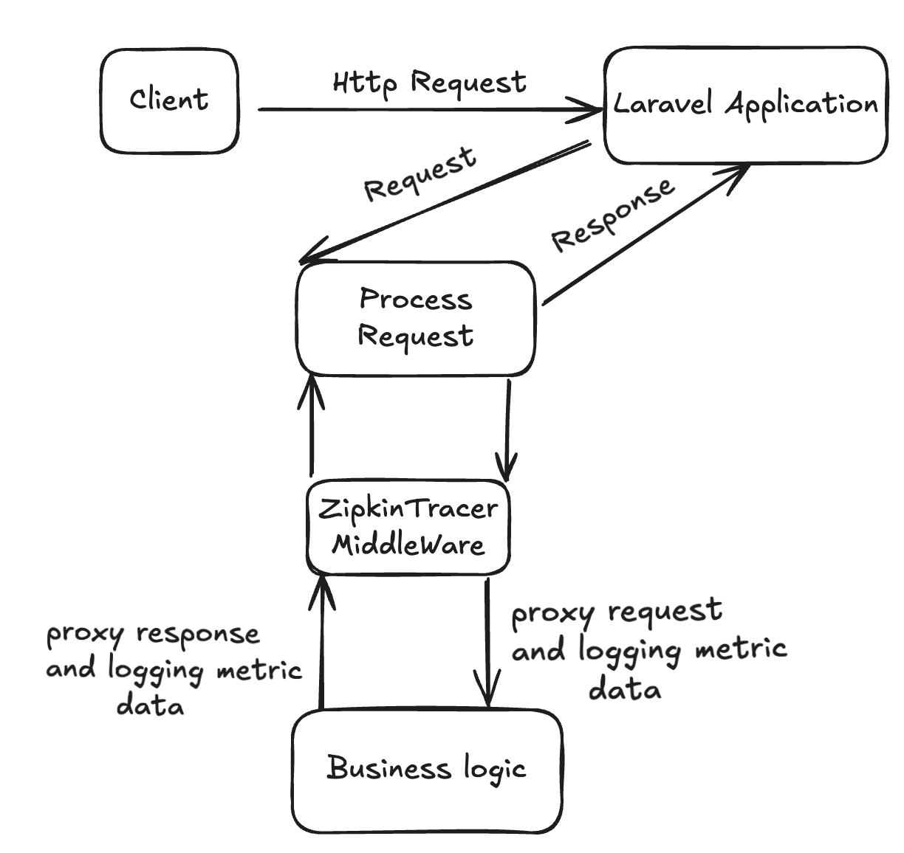
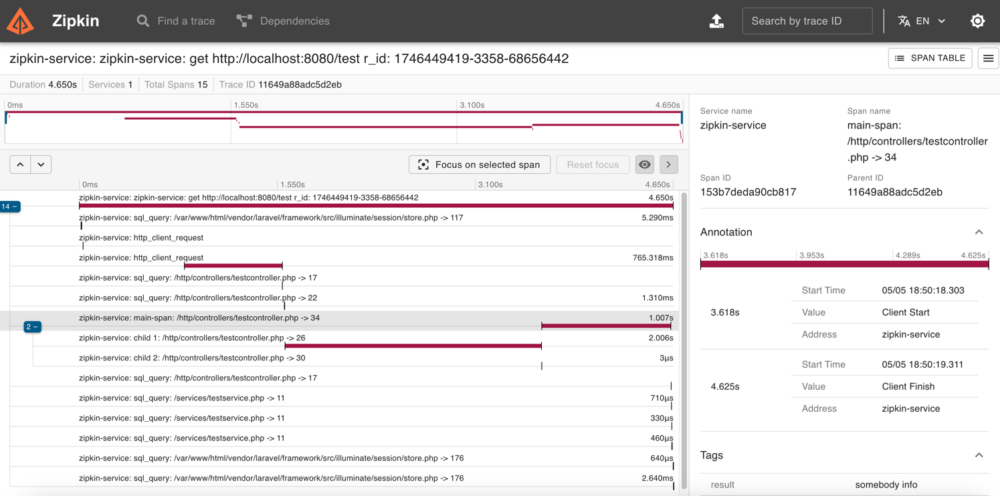

# Easy Zipkin tracer for Laravel

The tracing for Zipkin for your application based on Laravel

## Getting Started
`composer require xman12/laravel-zipkin-tracer`

## Requirements
- PHP ^8.2
- Laravel (^10)
- openzipkin/zipkin

## Setup

For getting start work with library add 
`ZipkinTracerProvider` to `app/bootstrap/providers.php`

Example:
```php 
return [
    App\Providers\AppServiceProvider::class,
    ZipkinTracerProvider::class,
];
```

after needed copy zipkin-tracer.php from `config` dir to your config dir.
We can change configuration params, for enable tracing just add 
`ZIPKIN_TRACER_ENABLE=true` into .env 

You can also configure other parameters from the configuration:
- ZIPKIN_TRACER_STORAGE_PATH 
- ZIPKIN_TRACER_SERVICE_NAME
- ZIPKIN_TRACER_ENDPOINT

## Configuration
 
For send data to Zipkin you need to add command `zipkin-tracer:sync_data` to cronjob
how often to call the command you decide yourself.

ZipkinTracer command collect all metric data
from files prepares them and sending to zipkin server

## Schema collect metric data 



## Create custom span

If, need create custom span, we can use it

example

```php
/** @var CustomSpanService $customSpanService */
$customSpanService = app(CustomSpanService::class);
$customSpan1 = $customSpanService->createSpan('span name', function () {
    return ['result' => 'somebody info', 'http.method' => 'GET'];
});
$customSpanService->addSpan($customSpan2);
```
This example shows how to create your own span.

You can also make nested spans

```php
/** @var CustomSpanService $customSpanService */
$customSpanService = app(CustomSpanService::class);
$customSpan1 = $customSpanService->createSpan('child 1', function () {
    sleep(2);
    return ['result' => 'somebody info', 'http.method' => 'GET'];
});
$customSpan3 = $customSpanService->createSpan('child 2', function () {
    return ['result' => 'somebody info', 'http.method' => 'GET'];
});

$customSpan2 = $customSpanService->createSpan('main-span', function () {
    sleep(1);
    return ['result' => 'somebody info'];
}, [$customSpan1, $customSpan3]);
$customSpanService->addSpan($customSpan2);
```

## What does it look like in Zipkin 



## Notice
For sending metric data we use `openzipkin/zipkin` library