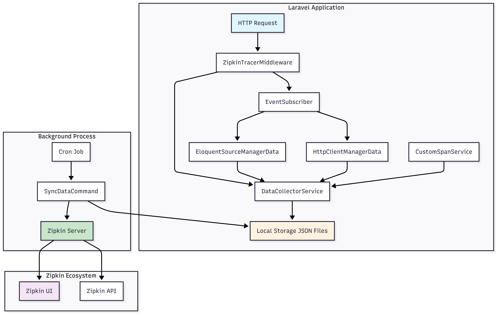

# Laravel Zipkin Tracer

[](https://php.net)
[](https://laravel.com)
[](LICENSE)

A specialized Laravel module that provides automatic tracing for HTTP requests, SQL queries, and custom spans with seamless Zipkin integration.

## 📋 Table of Contents

- [Overview](#overview)
- [Features](#features)
- [Architecture](#architecture)
- [Installation](#installation)
- [Configuration](#configuration)
- [Usage](#usage)
- [Examples](#examples)
- [Comparison with OpenTelemetry](#comparison-with-opentelemetry)
- [Monitoring & Debugging](#monitoring--debugging)
- [License](#license)

## 🎯 Overview

In modern microservice application development, it's crucial to have the ability to track request execution across various services. Distributed tracing allows developers to understand how requests flow through the system, identify bottlenecks, and diagnose performance issues.

**Laravel Zipkin Tracer** is a specialized module for Laravel that provides automatic tracing of HTTP requests, SQL queries, and allows creation of custom spans for integration with Zipkin — a popular distributed tracing system.

## ✨ Features

### 🔄 Automatic Tracing
- **HTTP Requests**: Method, URL, status code, request/response size, execution time, exceptions
- **SQL Queries**: Query text, execution time, file and line location, transactions (begin, commit, rollback)
- **HTTP Client Requests**: Outgoing HTTP requests via Laravel HTTP Client, headers, status codes, connection errors

### 🛠️ Custom Spans
- Create custom spans for business logic tracking
- Support for nested spans (parent-child relationships)
- Flexible tagging system
- Exception handling and error tracking

### ⚡ Performance Optimized
- Asynchronous data sending
- Minimal overhead
- Efficient file system storage
- Non-blocking operations

## 🏗️ Architecture

### System Architecture



### Data Collection Flow


## 📦 Installation

### Requirements

- PHP ^8.2
- Laravel ^10
- openzipkin/zipkin ^3.2

### Install via Composer

```bash
composer require xman12/laravel-zipkin-tracer
```

### Setup Provider

Add the provider to `app/bootstrap/providers.php`:

```php
return [
    App\Providers\AppServiceProvider::class,
    ZipkinTracerProvider::class,
];
```

### Publish Configuration

```bash
php artisan vendor:publish --tag=zipkin-tracer
```

## ⚙️ Configuration

### Environment Variables

Add these variables to your `.env` file:

```env
ZIPKIN_TRACER_ENABLE=true
ZIPKIN_TRACER_STORAGE_PATH=/path/to/storage/zipkin_tracer
ZIPKIN_TRACER_SERVICE_NAME=my-service
ZIPKIN_TRACER_ENDPOINT=http://127.0.0.1:9411/api/v2/spans
```

### Configuration Options

| Variable | Description | Default |
|----------|-------------|---------|
| `ZIPKIN_TRACER_ENABLE` | Enable/disable tracing | `false` |
| `ZIPKIN_TRACER_STORAGE_PATH` | Local storage path for JSON files | `storage_path('zipkin_tracer')` |
| `ZIPKIN_TRACER_SERVICE_NAME` | Service name in Zipkin | `Zipkin-service` |
| `ZIPKIN_TRACER_ENDPOINT` | Zipkin server endpoint | `http://127.0.0.1:9411/api/v2/spans` |

### Setup Cron Job

Add this to your crontab for data synchronization:

```bash
# Sync data to Zipkin every minute
* * * * * php artisan zipkin-tracer:sync_data
```

## 🚀 Usage

### Automatic Tracing

Once configured, the module automatically traces:

- **HTTP Requests**: All incoming HTTP requests
- **SQL Queries**: All database queries and transactions
- **HTTP Client**: All outgoing HTTP requests via Laravel HTTP Client

### Custom Spans

Create custom spans for business logic tracking:

```php
/** @var CustomSpanService $customSpanService */
$customSpanService = app(CustomSpanService::class);

// Simple span
$span = $customSpanService->createSpan('user-registration', function () {
    // Business logic for user registration
    $user = User::create([
        'name' => 'John Doe',
        'email' => 'john@example.com'
    ]);
    
    return [
        'user_id' => $user->id,
        'registration_method' => 'email'
    ];
});

$customSpanService->addSpan($span);
```

### Nested Spans

Create parent-child span relationships:

```php
// Child spans
$validationSpan = $customSpanService->createSpan('validate-user-data', function () {
    // Data validation logic
    return ['validation_passed' => true];
});

$emailSpan = $customSpanService->createSpan('send-welcome-email', function () {
    // Send welcome email
    return ['email_sent' => true];
});

// Parent span with children
$mainSpan = $customSpanService->createSpan('user-registration-process', function () {
    // Main logic
    return ['process_completed' => true];
}, [$validationSpan, $emailSpan]);

$customSpanService->addSpan($mainSpan);
```

## 📝 Examples

### Example 1: API Endpoint Tracing

```php
// UserController.php
class UserController extends Controller
{
    public function show($id)
    {
        /** @var CustomSpanService $customSpanService */
        $customSpanService = app(CustomSpanService::class);
        
        $span = $customSpanService->createSpan('get-user-profile', function () use ($id) {
            $user = User::with(['profile', 'posts'])->findOrFail($id);
            
            return [
                'user_id' => $user->id,
                'profile_complete' => $user->profile ? true : false,
                'posts_count' => $user->posts->count()
            ];
        });
        
        $customSpanService->addSpan($span);
        
        return response()->json($user);
    }
}
```

### Example 2: External API Tracing

```php
// ExternalApiService.php
class ExternalApiService
{
    public function fetchUserData($userId)
    {
        /** @var CustomSpanService $customSpanService */
        $customSpanService = app(CustomSpanService::class);
        
        $span = $customSpanService->createSpan('external-api-call', function () use ($userId) {
            // Laravel HTTP Client is automatically traced
            $response = Http::get("https://api.external.com/users/{$userId}");
            
            return [
                'external_user_id' => $userId,
                'response_status' => $response->status(),
                'response_size' => strlen($response->body())
            ];
        });
        
        $customSpanService->addSpan($span);
        
        return $response->json();
    }
}
```

### Example 3: Complex Business Logic Tracing

```php
// OrderService.php
class OrderService
{
    public function processOrder($orderData)
    {
        /** @var CustomSpanService $customSpanService */
        $customSpanService = app(CustomSpanService::class);
        
        // Order validation
        $validationSpan = $customSpanService->createSpan('validate-order', function () use ($orderData) {
            $validator = Validator::make($orderData, [
                'items' => 'required|array',
                'customer_id' => 'required|exists:customers,id'
            ]);
            
            if ($validator->fails()) {
                throw new ValidationException($validator);
            }
            
            return ['validation_passed' => true];
        });
        
        // Inventory check
        $inventorySpan = $customSpanService->createSpan('check-inventory', function () use ($orderData) {
            foreach ($orderData['items'] as $item) {
                $product = Product::find($item['product_id']);
                if ($product->stock < $item['quantity']) {
                    throw new InsufficientStockException();
                }
            }
            
            return ['inventory_available' => true];
        });
        
        // Order creation
        $orderSpan = $customSpanService->createSpan('create-order', function () use ($orderData) {
            DB::transaction(function () use ($orderData) {
                $order = Order::create([
                    'customer_id' => $orderData['customer_id'],
                    'total_amount' => $this->calculateTotal($orderData['items'])
                ]);
                
                foreach ($orderData['items'] as $item) {
                    $order->items()->create($item);
                }
            });
            
            return ['order_created' => true];
        });
        
        // Main span
        $mainSpan = $customSpanService->createSpan('process-order-complete', function () {
            return ['order_processed' => true];
        }, [$validationSpan, $inventorySpan, $orderSpan]);
        
        $customSpanService->addSpan($mainSpan);
    }
}
```

## 🔄 Data Flow
### Data Structure

Data is stored in JSON files with the following structure:

```json
{
  "queries": [
    {
      "query": "SELECT * FROM users WHERE id = ?",
      "duration": 0.001234,
      "start_time": 1640995200.123,
      "execute_file": "/app/Http/Controllers/UserController.php",
      "execute_file_line": 45
    }
  ],
  "http_data": {
    "method": "GET",
    "url": "/api/users/1",
    "status_code": 200,
    "request_size": 1024,
    "response_size": 2048,
    "time": 0.045,
    "request_id": "req_123456"
  },
  "http_client_data": [
    {
      "method": "POST",
      "url": "https://api.external.com/data",
      "headers": {"Authorization": "Bearer token"},
      "duration_time": 0.123,
      "status_code": 201
    }
  ],
  "custom_spans": [
    {
      "name": "user-registration",
      "duration_time": 0.234,
      "tags": {"user_id": 123, "method": "email"}
    }
  ]
}
```

### When to Use Laravel Zipkin Tracer

✅ **Recommended when:**
- You have a Laravel application
- Need simple and fast tracing setup
- Using Zipkin as tracing system
- Require minimal configuration

❌ **Not recommended when:**
- Need support for multiple tracing systems
- Require full OpenTelemetry compatibility
- Need advanced metrics capabilities
- Planning migration to other monitoring systems

## 📊 Monitoring & Debugging

### Viewing Data in Zipkin

After setting up synchronization, data will be available in the Zipkin web interface:

1. Open Zipkin UI (usually http://localhost:9411)
2. Select your service from the dropdown
3. Set the time range
4. View traces and spans

### Performance Analysis

In Zipkin you can see:

- **Execution time** of each span
- **Dependencies** between services
- **Performance bottlenecks**
- **Errors** and exceptions
- **SQL queries** with execution time

### Common Debugging Scenarios

1. **Slow Requests**: Analyze SQL query execution times
2. **External API Errors**: Review HTTP client requests
3. **Business Logic Issues**: Analyze custom spans
4. **Performance Issues**: Identify bottlenecks in request chains

### Storage Architecture


## 🛠️ Development

### Project Structure

```
src/
├── config/
│   └── zipkin-tracer.php
├── Console/
│   └── SyncDataCommand.php
├── DTO/
│   ├── CustomSpansDTO.php
│   ├── DBQueryDTO.php
│   ├── HttpRequestDTO.php
│   ├── HttpResponseDTO.php
│   └── RequestDTO.php
├── Enums/
│   └── Tags.php
├── Exceptions/
│   └── BaseException.php
├── Middleware/
│   └── ZipkinTracerMiddleware.php
├── Providers/
│   └── ZipkinTracerProvider.php
└── Services/
    ├── CustomSpanService.php
    ├── DataCollectorService.php
    ├── EloquentSourceManagerData.php
    ├── EventSubscriber.php
    ├── HttpClientManagerData.php
    ├── HttpRequestManagerData.php
    ├── Trace.php
    └── TraceObject.php
```

### Key Components

- **ZipkinTracerProvider**: Main service provider
- **ZipkinTracerMiddleware**: HTTP request interception
- **EventSubscriber**: Laravel event listening
- **DataCollectorService**: Data collection and storage
- **CustomSpanService**: Custom span creation
- **SyncDataCommand**: Data synchronization with Zipkin

## 📄 License

This project is licensed under the Apache License 2.0 - see the [LICENSE](LICENSE) file for details.

## 🙏 Acknowledgments

- [Zipkin](https://zipkin.io/) - Distributed tracing system
- [Laravel](https://laravel.com/) - PHP web framework
- [OpenZipkin](https://github.com/openzipkin/zipkin-php) - PHP Zipkin library

## 📞 Support

- **Author**: Aleksandr Belyshev
- **Email**: xman12@mail.ru
- **GitHub**: [https://github.com/xman12/laravel-zipkin-tracer](https://github.com/xman12/laravel-zipkin-tracer)

---

**Laravel Zipkin Tracer** remains an excellent choice for quickly implementing tracing in Laravel applications with minimal effort and maximum efficiency. 