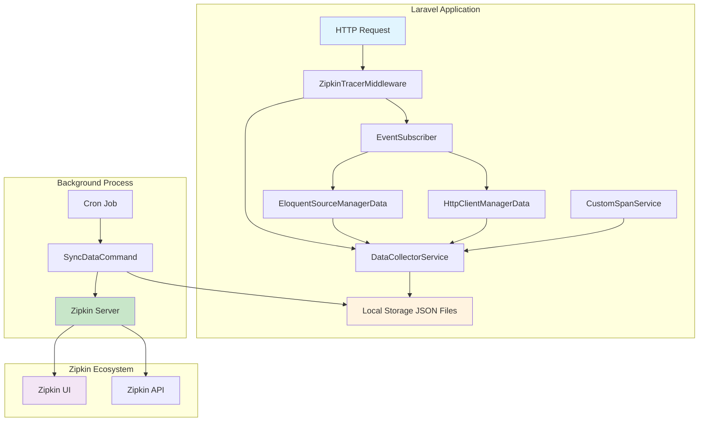
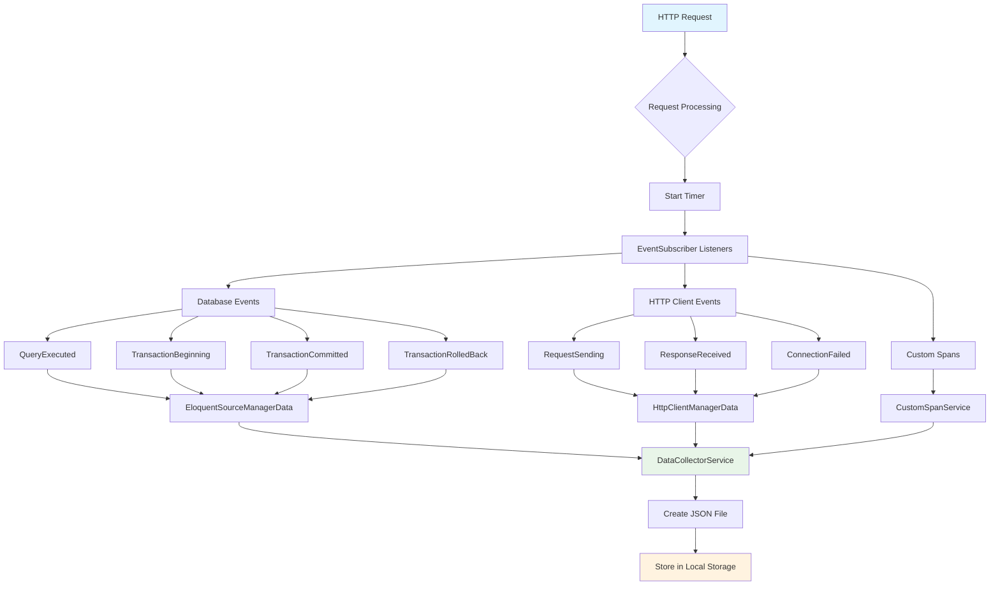
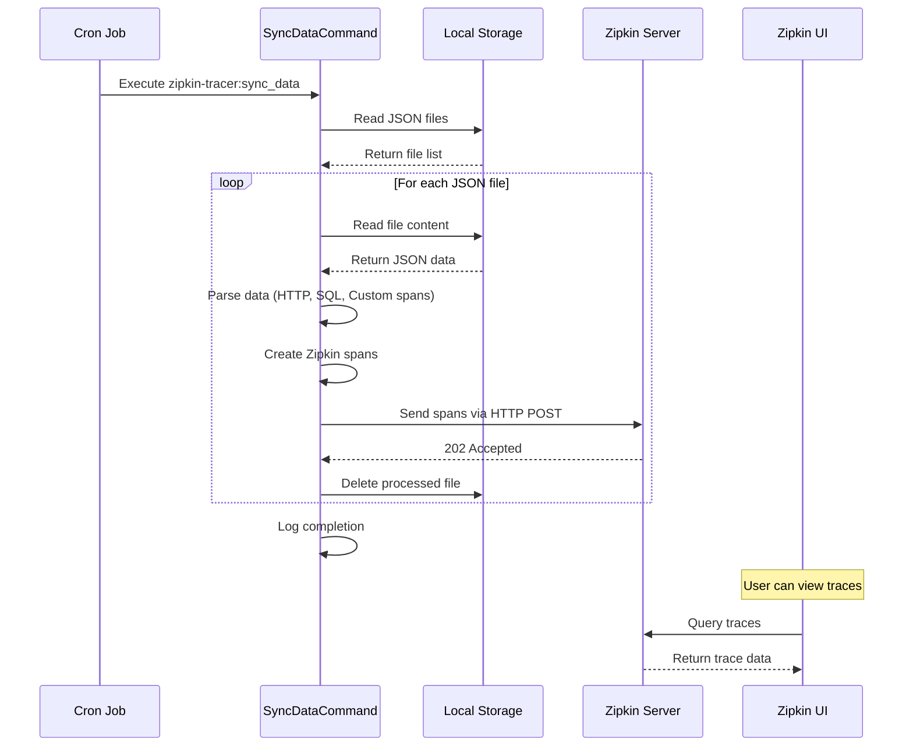
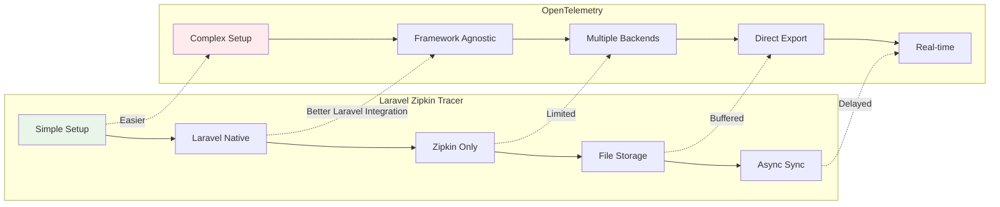
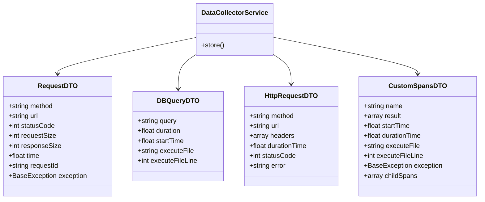
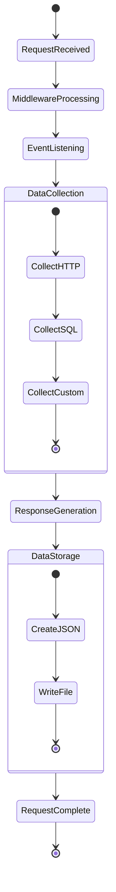
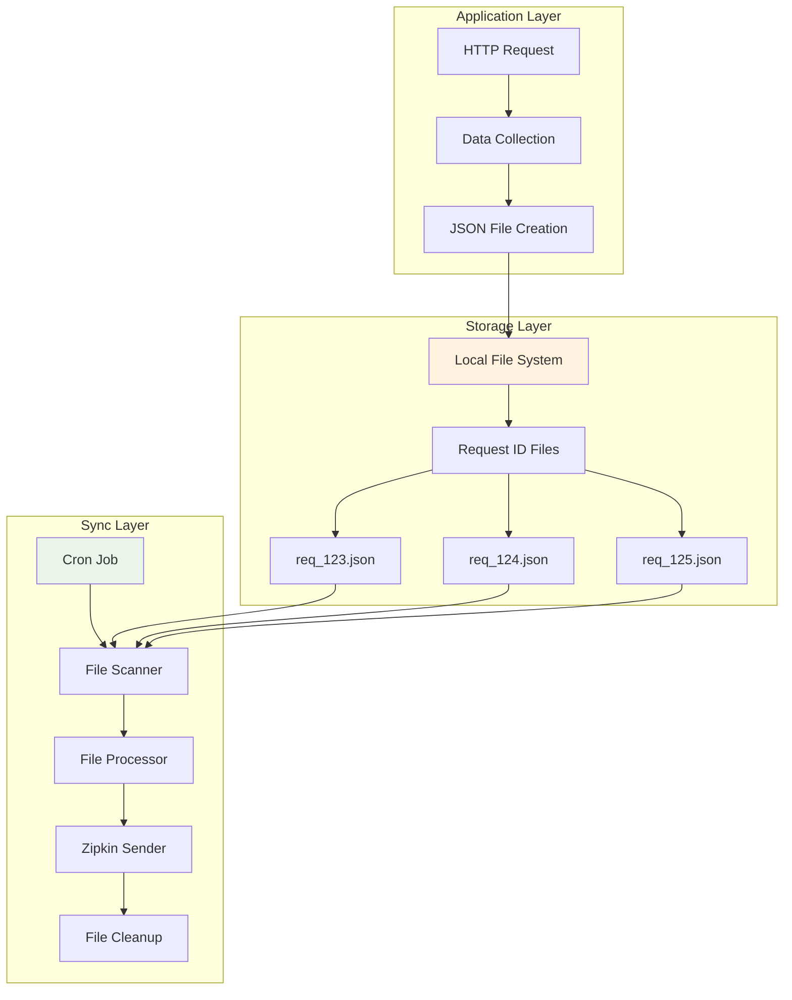
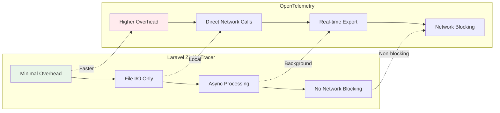

# Диаграммы архитектуры Laravel Zipkin Tracer

## 1. Общая архитектура системы

## 2. Детальная схема сбора данных

## 3. Процесс синхронизации с Zipkin

## 4. Сравнение с OpenTelemetry

## 5. Структура данных трейсинга

## 6. Жизненный цикл запроса

## 7. Архитектура хранения данных

## 8. Сравнение производительности

